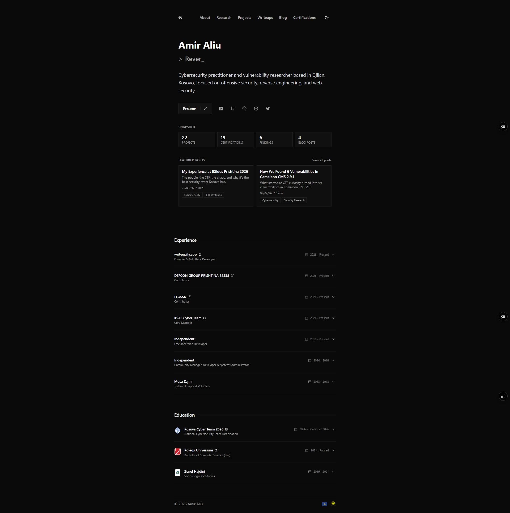
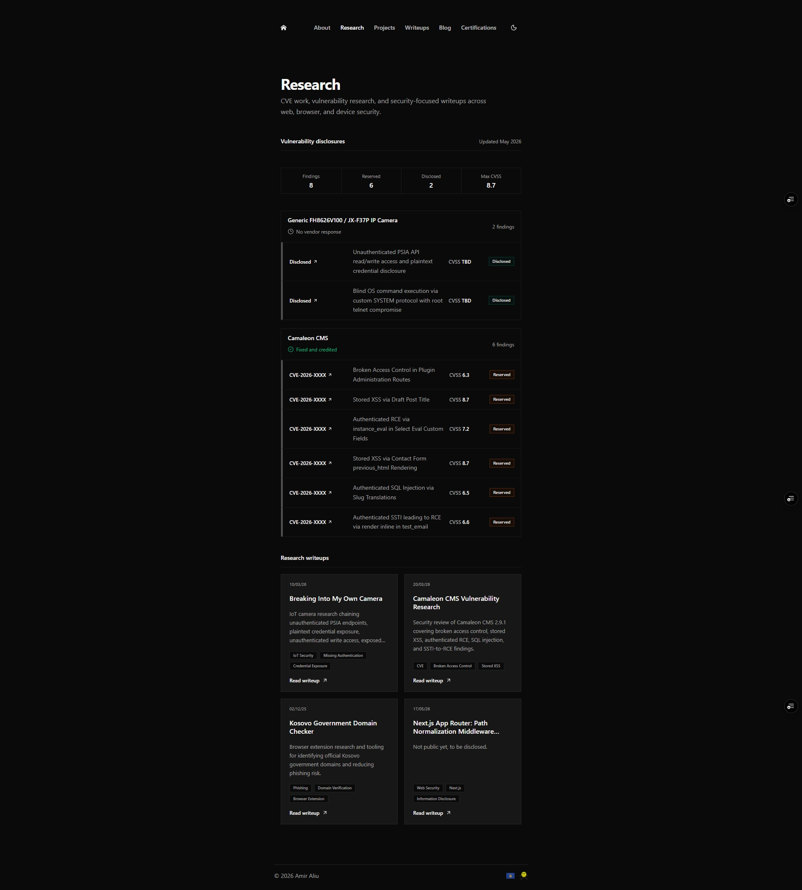
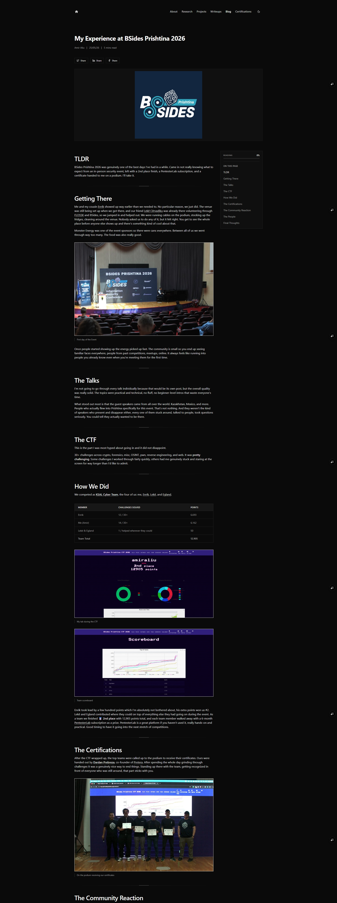
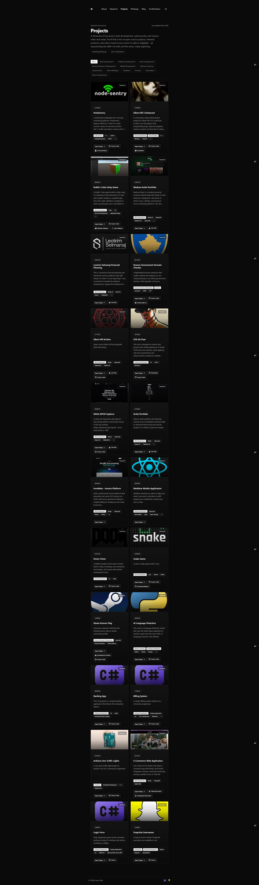
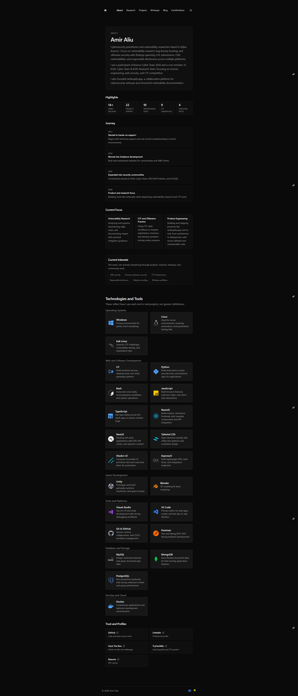
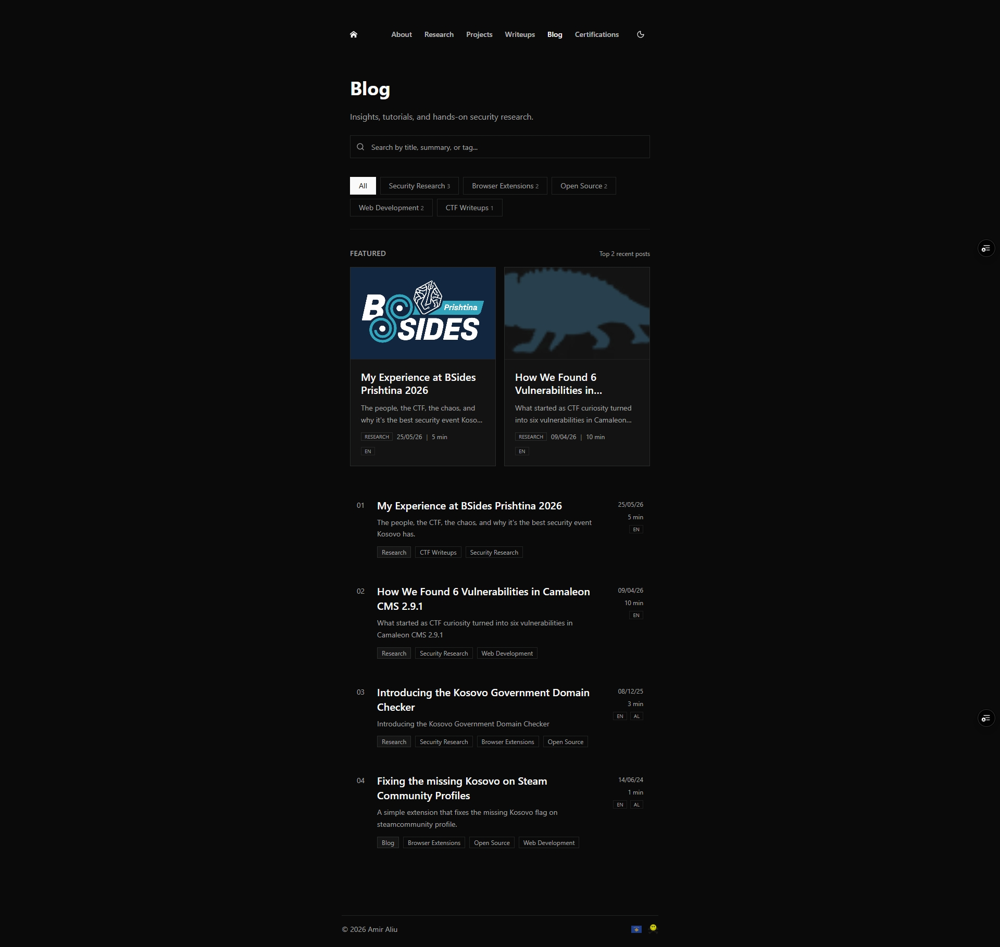
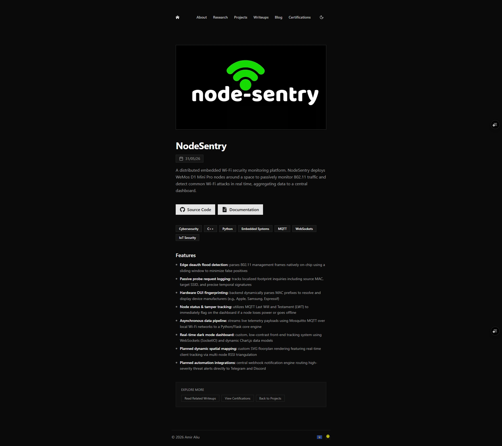
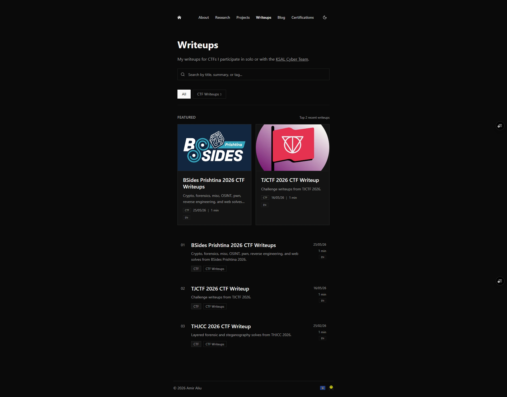
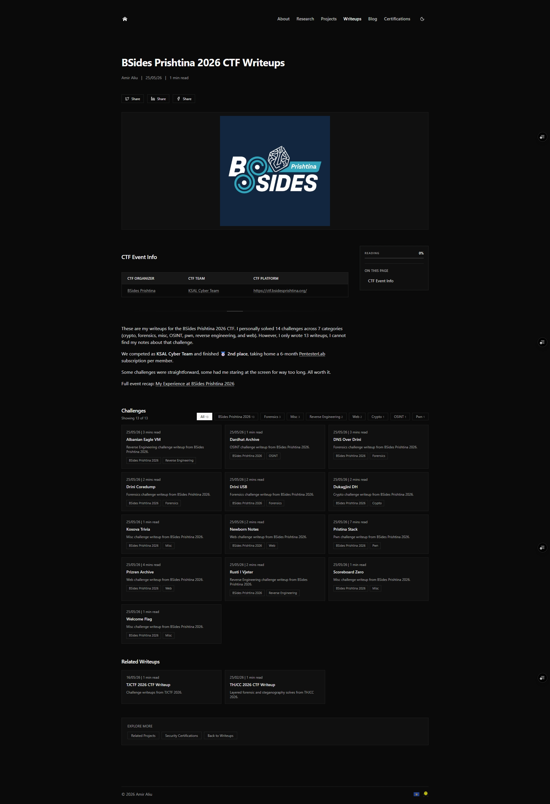
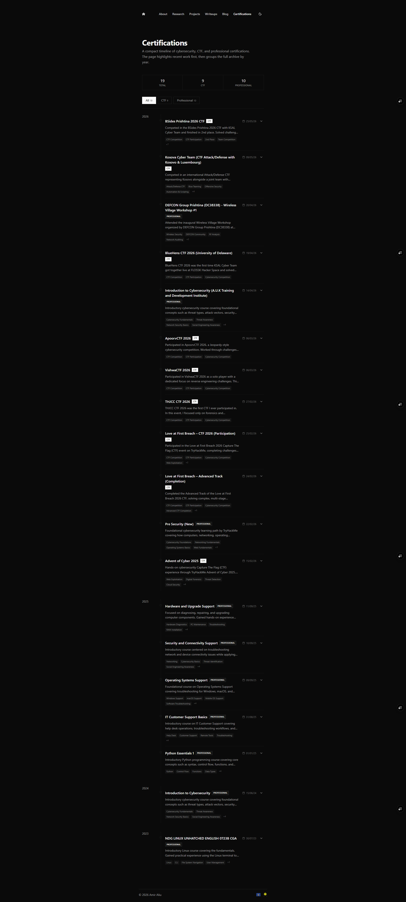

# Amir Aliu - Portfolio & Research Log


A personal portfolio and research log built with Next.js, markdown-driven content, bilingual (EN/AL) blog, dark/light theming, and SEO handled out of the box. Open-sourced so other students and professionals in dev/security don't have to build one from zero.

**Live:** [amiraliu.vercel.app](https://amiraliu.vercel.app) · **Fork it and make it yours**, see [Making it yours](#making-it-yours) below.

## Screenshots

<table>
<tr>
<td width="50%"><br/><sub align="center">Home</sub></td>
<td width="50%"><br/><sub>Research - CVE/disclosure tracking</sub></td>
</tr>
<tr>
<td width="50%"><br/><sub>Blog post - TOC, reading progress, MDX</sub></td>
<td width="50%"><br/><sub>Projects - filterable, categorized</sub></td>
</tr>
</table>

<details>
<summary>More screenshots (About, Blog index, Project detail, Writeups, Writeup detail, Certifications)</summary>
<br/>

<table>
<tr>
<td width="50%"><br/><sub>About</sub></td>
<td width="50%"><br/><sub>Blog index</sub></td>
</tr>
<tr>
<td width="50%"><br/><sub>Project detail</sub></td>
<td width="50%"><br/><sub>Writeups index</sub></td>
</tr>
<tr>
<td width="50%"><br/><sub>Writeup detail</sub></td>
<td width="50%"><br/><sub>Certifications</sub></td>
</tr>
</table>

</details>

## Why I built this

Most portfolio templates look generic and don't leave room for an actual body of work. I wanted something closer to a researcher's logbook, CVE tracking, CTF writeups, bilingual blog posts, projects, certs, all in one place, written in plain markdown instead of fought through a CMS. Open-sourcing it so other students and early-career devs/researchers have a real starting point instead of a blank repo.

## What is included
- Home page with:
  - profile intro
  - social links
  - live snapshot metrics (projects, certs, posts)
  - featured blog posts
  - animated experience and education sections
  - resume preview sheet with open/download fallback links
- Projects section with:
  - category filters for web, software, game, browser extension, mobile, ML, hardware, security, and automation work
  - project cards with stack/category badges
  - detailed project pages with media galleries and structured metadata
- Certifications section with category filters (`All`, `Professional`, `CTF`) and expandable details
- Research section with CVE/disclosure tracking and links to related writeups
- Blog section with:
  - search and tag filters
  - featured posts
  - EN/AL language support (with language switch on post pages)
  - reading time, reading progress bar, and table of contents
  - related posts by language/tag relevance
  - per-post hero image mode (`cover` or `contain`) via frontmatter
- Writeups section for CTF writeups from solo and team competitions
- About page with highlights, journey timeline, focus areas, and trust/profile links
- Testimonials route (currently intentionally not publishing testimonials)

## SEO and metadata features
- Route-level metadata for core pages
- Open Graph + Twitter cards
- JSON-LD structured data (Person, Website, CollectionPage, BlogPosting, Breadcrumbs)
- Canonical URLs
- Multilingual alternates (`hreflang`) for EN/AL blog variants
- Dynamic sitemap with blog, writeup, project, and core page routes
- Dynamic OG image route

## Stack
- Next.js 16 (App Router)
- React 19
- TypeScript
- Tailwind CSS 4
- MDX (`next-mdx-remote`) for blog content
- Framer Motion, Radix UI, Lucide, React Icons
- Vercel Analytics + Speed Insights
- Playwright for E2E tests

## Making it yours

If you're forking this to build your own portfolio, work through this checklist:

- [ ] Replace personal data in `data/*` (projects, certifications, experience, metadata, tech stack)
- [ ] Update `baseUrl` in `app/sitemap.ts` to your own domain
- [ ] Regenerate metadata/OG values (titles, descriptions, social images) to match your own info
- [ ] Swap assets in `public/icons`, `public/brand`, and page-specific media folders with your own
- [ ] Update social/profile links (GitHub, LinkedIn, resume, etc.)
- [ ] Replace or clear out `content/blog-posts/` and `content/writeups/` and add your own MDX content
- [ ] Set up your own Vercel Analytics/Speed Insights project, or remove those packages if you don't want analytics
- [ ] Update the `LICENSE` copyright name/year if you want it under your own name too

## Getting started

**Requirements:** Node.js 20+ (required for Next.js 16 / React 19)

```bash
npm install
npm run dev
```

Open `http://localhost:3000`

**Environment variables:** none required for local dev. Vercel Analytics/Speed Insights activate automatically when deployed on Vercel and don't need local config.

## Deploy

The site is built for Vercel. Click below to deploy your own copy (update the URL to point at your fork once it's pushed):

[](https://vercel.com/new/clone?repository-url=https://github.com/amiraliuks/portfolio)

Or build manually:

```bash
npm run build
```

<details>
<summary>Scripts</summary>

```bash
npm run dev
npm run build
npm run start
npm run lint
npm run lint:fix

npm run format:content
npm run validate:content
npm run validate:images
npm run validate:images:strict
npm run validate:seo

npm run test:e2e
npm run test:e2e:headed
```

</details>

<details>
<summary>Content notes</summary>

Blog posts are stored in `content/blog-posts/*.mdx`.

CTF writeups are stored in `content/writeups/*.mdx`.

Supported frontmatter fields include:
- `title`
- `publishedAt`
- `summary` / `description`
- `public`
- `tags`
- `image`
- `language` (`en` or `al`)
- `translationKey`
- `heroFit` (`cover` or `contain`)

</details>

<details>
<summary>Project structure (high-level)</summary>

- `app/` - routes and page-level metadata
- `components/` - UI and feature components
  - `components/layout/` - navbar, footer, theme provider, progress bar
  - `components/sections/` - home, project, research, certification, education, experience sections
  - `components/media/` - resume sheet, image modal, badge sheet, project media showcase
  - `components/blog/`, `components/mdx/`, `components/ui/` - blog helpers, MDX rendering, shared UI primitives
- `content/blog-posts/` - MDX blog posts
- `content/writeups/` - CTF writeups
- `data/` - projects, certifications, experience, metadata, tech stack
- `lib/` - parsing, SEO helpers, analytics helpers, utility functions
- `public/` - static assets
  - `public/icons/` - favicon and app icons
  - `public/brand/` - brand/supporting footer assets
  - `public/og/` - static OG/reference images
  - `public/projects/`, `public/certifications/`, `public/education/`, `public/blog-posts/`, `public/ctf-writeups/` - page-specific media
- `scripts/` - content/SEO/image validation scripts
- `tests/` - Playwright E2E tests

</details>

## License

MIT - see [LICENSE](LICENSE). Free to fork, modify, and use for your own portfolio.

## Acknowledgments

Built with [Next.js](https://nextjs.org), [shadcn/ui](https://ui.shadcn.com), [Radix UI](https://www.radix-ui.com), and deployed on [Vercel](https://vercel.com).